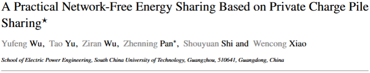

# PCPS-Based-Energy-Sharing-Case-Setting

  

 

# Overview  
This project is a instruction for the ***parameters*** of the case studies in our paper  ***"A Practical Network-Free Energy Sharing Based on Private Charge Pile Sharing"***. 

> _**Toy Case**_: The parameters of the PCPS matching and PCPS-Based energy sharing problem on Toy case, involving 4 households.  
> _**ShenZhen Case**_: The parameters of the PCPS matching and PCPS-Based energy sharing problem on ShenZhen case, involving 1615 households.  

# Parameters Description
The parameters for each case are recorded in 4 Excel files, including ***PCPParameters.xlsx***, ***EVParameters.xlsx***

## PCPParameters.xlsx
This file contains all parameters for each private charging piles (PCP), where:

>_**'PCP_Index'**_ : The index of each PCP;  
>_**'Household_index'**_ : The index for the household associated with PCP;  
>_**'T_ksta'**_ : The available start time of PCP;  
>_**'T_kend'**_ : The available end time of PCP;  
>_**'P_powermax'**_ : The maximum discharge/charging power of PCP;  
>_**'p_sermin'**_ : The PCP's minimum acceptable service fee per kWh;  
>_**'x and y'**_ : The location of PCP;  

## EVParameters.xlsx
This file contains all parameters for each electri vehicle (EV), where:
>_**'EV_Index'**_ : The index of each EV;  
>_**'Household_index'**_ : The index for the household associated with EV;  
>_**'t_arp'**_ : EV's arrival times at PCP;  
>_**'t_lep'**_ : EV's departure times at PCP;
>_**'t_arh'**_ : EV's arrival times at home;  
>_**'t_leh'**_ : EV's departure times at home;  
>_**'EEVexp'**_ : EV’s desired charging capacity at matched PCP;  
>_**'p_serHmax'**_ : EV's maximum acceptable service fee per kWh;  
>_**'x and y'**_ : The location of EV;
>_**'ItaEV'**_ : The charging and discharging efficiencies of EV;  
>_**'aEV, bEV and cEV'**_ : The discharging degradation coefficients of EV;  
>_**'EEVarh'**_ : The initial energy of EV when arrive at home;  
>_**'EEVlehmin'**_ : The minimum energy of EV when departuring home;  
>_**'EEVtra'**_ : The energy consumption of EV during _**'t_leh'**_ to _**'t_arp'**_;  
>_**'EEVup'**_ : EV’s maximum capacity;
>_**'EEVlow'**_ : EV’s minimum capacity;  

## EVParameters.xlsx
This file contains all parameters for each electri vehicle (EV), where:
>_**'EV_Index'**_ : The index of each EV;  
>_**'Household_index'**_ : The index for the household associated with EV;  
>_**'t_arp'**_ : The available start time of PCP;  
>_**'t_lep'**_ : The available end time of PCP;  
>_**'EEVexp'**_ : The maximum discharge/charging power of PCP;  
>_**'p_serHmax'**_ : The PCP's minimum acceptable service fee per kWh;  
>_**'x and y'**_ : The location of PCP;
>_**'ItaEV'**_ : The index of each PCP;  
>_**'Household_index'**_ : The index for the household associated with PCP;  
>_**'aEV, bEV and cEV'**_ : The available start time of PCP;  
>_**'EEVarh'**_ : The available end time of PCP;  
>_**'EEVlehmin'**_ : The maximum discharge/charging power of PCP;  
>_**'EEVtra'**_ : The PCP's minimum acceptable service fee per kWh;  
>_**'EEVup'**_ : The location of PCP;  
>_**'EEVarh'**_ : The available end time of PCP;  
>_**'EEVlow'**_ : The maximum discharge/charging power of PCP;  
>_**'tarh'**_ : The PCP's minimum acceptable service fee per kWh;  
>_**'tleh'**_ : The location of PCP;  

